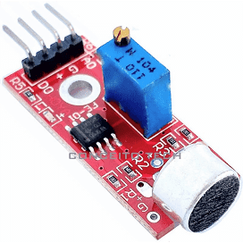
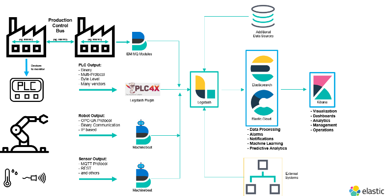
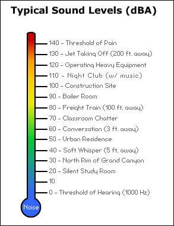

Apresentação do desafio
=======================

O objetivo do documento é apresentar o desafio repassado aos
participantes do Hackathon que acontecerá nos dias 15, 16 e 17 de
janeiro de 2021.

Poluição sonora
---------------

A poluição sonora é um problema de saúde pública persistente para quem
reside em ambiente urbano. Segundo alguns estudos [1] de 70% a 90% das
pessoas que vivem nas maiores cidades são expostos a barulhos
ultrapassando as recomendações da Organização Mundial da Saúde (OMS)[2].

A exposição a sons fortes provoca danos a saúde com a destruição de
células sensoriais do ouvido que pode provocar uma perda auditiva
temporária ou permanente. Além desses problemas a poluição sonora pode
provocar:

-   Distúrbio de sono.

-   Estresse e ansiedade.

-   Dores de cabeça.

-   Perda de concentração e consequentemente diminuição da
    produtividade, que seja no trabalho ou nos estudos.

-   Alteração da frequência cardíaca e respiratória.

-   Aumento da pressão arterial.

Além dos humanos, os animais são prejudicados da mesma forma. Estudos
[3] demonstram que várias espécies sofrem da poluição sonora, por
exemplo morcegos que dependem de sinais acústicos para encontrar presas.
Anfíbios, pássaros, insetos e mamíferos dependem do som para transmitir
informações essenciais, como acasalamento e sinais de alerta. Muitas
espécies estão fortemente ameaçadas pela poluição sonora.

Smart Cities e IoT
------------------

Existem leis sobre o ruído que visam reduzir a poluição sonora, mas as
avaliações e monitoramento desses sons são realizadas com pouca
frequência e são principalmente baseados em reclamações feitas pelos
moradores.

As cidades inteligentes, as chamadas *Smart Cities*, são as que usam
tipos diferentes de sensores eletrônicos para coletar dados e usá-los
para gerenciar recursos e ativos eficientemente [4]. Dentro dos itens
que podem ser monitorados em cidades inteligentes temos:

-   Iluminação pública.

-   Poluição do ar.

-   Transporte.

-   Distribuição de energia.

-   Monitoramento dos sons da cidade.

Os sensores conectados utilizados para efetuar as medições fazem parte
da Internet das Coisas (IoT - *Internet of Things* em inglês). Todos
eles estão interconectados e enviam as medidas para serviços
encarregados do processamento.

Desafio
=======

O objeto do desafio é construir um sistema de monitoração e alerta de
poluição sonora. Esse sistema será composto de vários módulos com
objetivos diferentes. Descreveremos em seguida esses módulos e algumas
sugestões de tecnologias para implementação da solução.

Embora falamos sobre *Smart Cities*, o projeto pode se aplicar em um
ambiente de tamanho menor, por exemplo, uma fábrica onde os incômodos
provocados por altos níveis de barulho podem ser prejudiciais.

Módulo 1 - Sensores
-------------------

Nesse módulo deverão ser desenvolvidos os aparelhos que enviarão os
dados para os serviços. As informações deverão ser enviadas de tempo em
tempo e conterão: \* Data/Hora da aferição. \* Localização. \* Medição
em decibéis.

A localização poderá um ponto definido pela latitude e longitude, neste
caso pode ser incluído um módulo tipo GPS [5] ou a posição pode ser
configurada na instalação. No caso de monitoramento em um ambiente
fechado, essa posição poderá ser uma *String*, Refeitório canto
noroeste.

Os aparelhos IoT são geralmente conectados a um *Gateway* local que
efetua o envio dos dados para os serviços de processamento. Para esse
desafio a transmissão pode ser feita diretamente pelo sensor para
simplificar, o objetivo sendo mostrar a viabilidade de construção de um
aparelho desse tipo por um custo baixo.

A geração dos dados dos sensores pode ser simulada, como por exemplo com
o uso do [Kafka Connect
Datagen](https://docs.confluent.io/platform/current/tutorials/examples/clients/docs/kafka-connect-datagen.html).
Ele pode ser usado como método para simular os dados coletados dos
sensores e envialos para um ponto único.

Algumas **sugestões** de tecnologia para o desenvolvimento são:

-   Plataforma: Arduino, Raspberry PI, M5 Stack

-   Sensor de som tipo FC04

-   ESP8266/NodeMCU para comunicações

Módulo 2 - Serviços de recebimento e agregação dos dados
--------------------------------------------------------

Nesse módulo serão desenvolvidas as funcionalidades de captura e
processamento das medições. Deve ser previsto o processamento de
milhares de dados oriundos dos sensores espalhados na cidade (ou em
vários locais, fábricas).

Esse processamento deverá permitir trabalhar com séries temporais de
dados e geolocalização. O resultado desse módulo como cálculos, limpeza,
etc. será utilizado como insumo para a criação dos dashboards,
relatórios. Entre nesse módulo a geração de alertas quando os valores
medidos passam de um determinado valor (configurável) durante um período
(ajustável também). No escopo dos serviços entra o armazenamento dos
dados para execução de queries e relatórios do módulo 3.

Outro ponto a considerar é o monitoramento dos sensores, por exemplo,
verificar quais não mandam dados desde um certo intervalo de tempo, ou
envia medidas com uma diferença muito grande comparando com aparelhos
próximos.

Para o desenvolvimento, seguem algumas **sugestões** de tecnologia:

-   Stack baseada em Kafka

    -   Entrada dos dados com
        [MQTT](https://mosquitto.org/man/mqtt-7.html) ou [Kafka Rest
        Proxy](https://docs.confluent.io/current/kafka-rest/index.html)
        enviados para um cluster [Kafka](https://kafka.apache.org/).

    -   Processamento dos dados com [Kafka
        Streams](https://kafka.apache.org/documentation/streams/) ou
        [Ksql](https://ksqldb.io/)

    -   Envio dos dados para uma base que trabalha com séries temporais
        como [Elasticsearch](https://www.elastic.co/pt/elasticsearch/)
        ou [InfluxDb](https://www.influxdata.com/).

-   Stack Elastic

    -   Ingestão de dados enviados em filas MQTT ou serviços REST com
        [Filebeat](https://www.elastic.co/pt/beats/filebeat).

    -   Processamento com filtros
        [Logstash](https://www.elastic.co/pt/logstash) e armazenamento
        no Elasticsearch.

-   KNative e Serverless

    -   Uso do [Broker](https://knative.dev/docs/eventing/broker/) do
        [Knative Eventing](https://knative.dev/docs/eventing/) para
        receber os dados dos sensores

    -   Serviços rodando com [Knative](https://knative.dev/) ativados
        por *Triggers* para efetuar os cálculos. Esses serviços podem
        ser combinados em fluxos de processamento. Os dados podem ser
        enviados por qualquer banco que trabalha com séries temporais.

> **Tip**
>
> Para um ambiente 100% Kubernetes, pode ser utilizado o
> [Kubeedge](https://kubeedge.io/en/)

Para os serviços de Streams com Kafka, Elasticsearch ou KNative podem
ser utilizados frameworks de mercado como [Spring
Boot](https://spring.io/projects/spring-boot) (com [Spring Cloud
Stream](https://docs.spring.io/spring-cloud-stream/docs/3.0.8.RELEASE/reference/html/))
ou [Quarkus](https://quarkus.io/) (como [Quarkus
Funqy](https://quarkus.io/guides/funqy-knative-events)). O uso do Python
pode ser interessante pois a linguagem possui muitas implementações de
bibliotecas científicas úteis no contexto do desafio.

Os possíveis níveis de exposição do volume sonoro que são aceitos por
[período de
tempo](https://www.osha.gov/laws-regs/regulations/standardnumber/1910/1910.95)
podem ser encontrados no site da [OSHA](https://www.osha.gov/noise).

<table>
<caption>Níveis de som aceitos</caption>
<colgroup>
<col width="50%" />
<col width="50%" />
</colgroup>
<tbody>
<tr class="odd">
<td>
Duração por dia (horas)
</td>
<td>
Volume sonoro (dBA)
</td>
</tr>
<tr class="even">
<td>
8
</td>
<td>
90
</td>
</tr>
<tr class="odd">
<td>
6
</td>
<td>
92
</td>
</tr>
<tr class="even">
<td>
4
</td>
<td>
95
</td>
</tr>
<tr class="odd">
<td>
3
</td>
<td>
97
</td>
</tr>
<tr class="even">
<td>
2
</td>
<td>
100
</td>
</tr>
<tr class="odd">
<td>
1 1/2
</td>
<td>
102
</td>
</tr>
<tr class="even">
<td>
1
</td>
<td>
105
</td>
</tr>
<tr class="odd">
<td>
1/2
</td>
<td>
110
</td>
</tr>
<tr class="even">
<td>
1/4 ou menor
</td>
<td>
115
</td>
</tr>
</tbody>
</table>

Módulo 3 - Dashboards e relatórios de monitorammento
----------------------------------------------------

Nesse módulo serão desenvolvidas as visuzalições para acompanhar e
monitorar os locais barulhentos. Deverá ser possível visualizar os dados
em tempo real em mapas ou plantas. A geração de relatórios como o de
locais mais barulhentos por período (por exemplo, uma rua de 10h a 12h,
o refeitório de 11h30 a 12h45).

Seguem algumas ferramentas que podem ser utlizadas:

-   [Pentaho](https://www.hitachivantara.com/en-us/products/data-management-analytics/pentaho-business-analytics.html)
    para criação e visualização de dashboards e relatórios criados a
    partir de datasources externos.

-   [Kibana](https://www.elastic.co/pt/kibana) para criação de
    dashboards e visualizações a partir de dados do Elasticsearch.

-   [Grafana](https://grafana.com/) para criação de dashboards

[1] Ver por exemplo
<https://www.ncbi.nlm.nih.gov/pmc/articles/PMC4918656/>

[2] Ver documentação no site da OMS:
<https://www.who.int/docstore/peh/noise/Comnoise-1.pdf> e
<https://www.who.int/docstore/peh/noise/Comnoise-4.pdf>.

[3] Exemplo de estudo sobre o impacto dos sons prodduzidos pelos humanos
nos animais:
<https://royalsocietypublishing.org/doi/full/10.1098/rsbl.2019.0649>

[4] Wikipedia - <https://pt.wikipedia.org/wiki/Cidade_inteligente>

[5] A plataforma NodeMCU pode ser utilizada para geolocalização,
exemplo:
<https://circuitdigest.com/microcontroller-projects/how-to-track-location-with-nodemcu-using-google-map-api>
